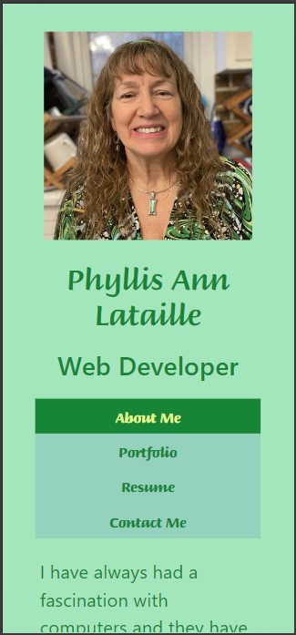
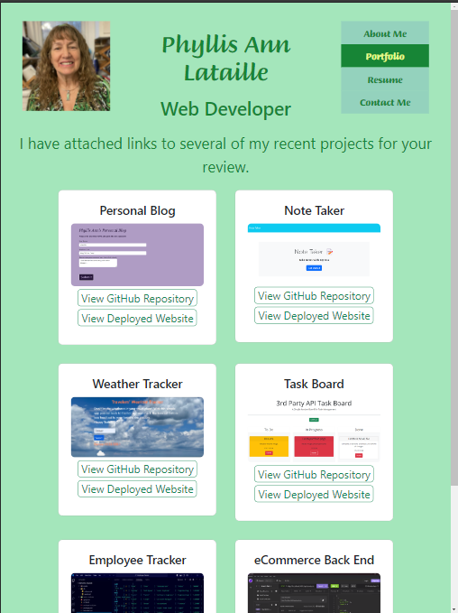
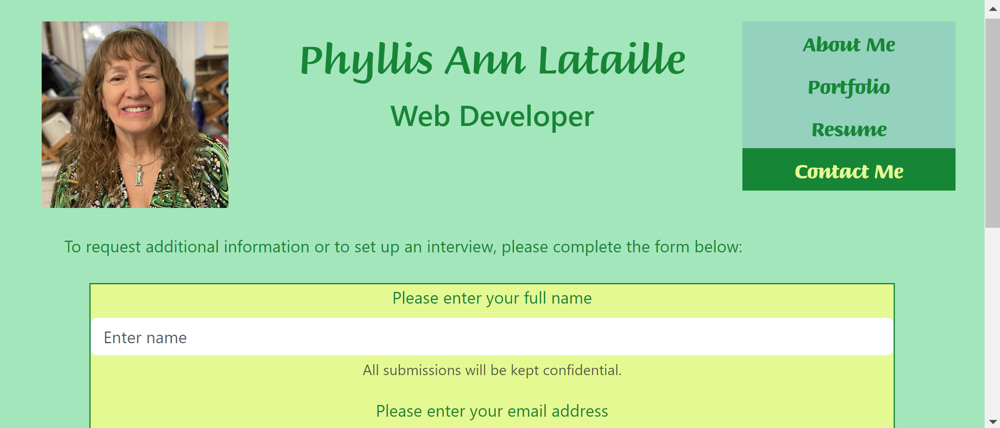

# Phyllis-Ann-Lataille-React-Portfolio

## Description

This application is the author's professional portfolio built using React, Vite, Bootstrap, and JavaScript.
I was invested in this project as a means to facilitate my job search. The portfolio gives the view the ability to view my qualifications and samples of my work. It was a challenge styling my portfolio using Bootstrap and React and I had to search for solutions to ultimately get the desired look and responsiveness.

## Table of Contents (Optional)

- [Features](#features)
- [Installation](#installation)
- [Usage](#usage)
- [Credits](#credits)
- [License](#license)
- [Contributions](#contributions)
- [Questions](#questions)
- [User Story](#user_story)

## Features

This project features five virtual pages in a single page website. Its main.jsx and app.jsx files configure and render three sections; header, outlet, and footer to this single page application, so that the header and footer appear on the page and the outlet renders the actual pages (AboutMePage, ContactMePage, ErrorPage, PortfolioPage, and ResumePage). he ContactMePage features a form to be completed by interested users.

The Header component renders the author's profile image, H1 and H2 providing the Author's name and job title, and the nav component to navigate to any of the virtual pages from any of the virtual pages.

The AboutMePage is the default component and provides a short biography of the author's professional experience. The ContactMePage renders a form so that interested users can send a message to the author. The ErrorPage renders any errors detected by the server. The PortfolioPage renders 6 "cards" that contain screenshots and repository and deployment information for 6 of the author's projects and the ResumePage renders content with links that allow the user to view the author's resume as an image and/or download a PDF version of the resume.

## Installation

Installation of the portfolio requires the following command line input:

npm run dev

## Usage

When the application opens, the user will be on the default page (AboutMe). Using the Nav bar at the top of the page, the user can navigate to and from any of the virtual pages.

Mobile View:

Tablet View:

Desktop View:

## Credits

I collaborated with the following individuals: Tyler Meyers, Tutor Megan Meyers.

I also consulted the following third-party assets:

- Bootstrap docs: https://getbootstrap.com/docs/5.3/getting-started/introduction/
- React Getting Started: https://react.dev/learn
- Vite Getting Started: https://vitejs.dev/guide/
- Vite Deployment: https://vitejs.dev/guide/static-deploy.html#deploying-a-static-site
- Vite Deployment with Netlify: https://vitejs.dev/guide/static-deploy.html#netlify-with-git

## License

Copyright (c) 2024 Phyllis Ann Lataille

Permission is hereby granted, free of charge, to any person obtaining a copy
of this software and associated documentation files (the "Software"), to deal
in the Software without restriction, including without limitation the rights
to use, copy, modify, merge, publish, distribute, sublicense, and/or sell
copies of the Software, and to permit persons to whom the Software is
furnished to do so, subject to the following conditions:

The above copyright notice and this permission notice shall be included in all
copies or substantial portions of the Software.

THE SOFTWARE IS PROVIDED "AS IS", WITHOUT WARRANTY OF ANY KIND, EXPRESS OR IMPLIED, INCLUDING BUT NOT LIMITED TO THE WARRANTIES OF MERCHANTABILITY, FITNESS FOR A PARTICULAR PURPOSE AND NONINFRINGEMENT. IN NO EVENT SHALL THE AUTHORS OR COPYRIGHT HOLDERS BE LIABLE FOR ANY CLAIM, DAMAGES OR OTHER LIABILITY, WHETHER IN AN ACTION OF CONTRACT, TORT OR OTHERWISE, ARISING FROM, OUT OF OR IN CONNECTION WITH THE SOFTWARE OR THE USE OR OTHER DEALINGS IN THE
SOFTWARE.

## Contributions

Any contributions made in the spirit of sharing ideas and concepts, will be greatly appreciated. If you have any suggestions that would make this app better, please fork the repo and create a pull request. You can also open an issue with the tag "contribute". Please give this project a star!

### Instructions for forking:

1. Fork the Project
2. Create your Feature Branch (git checkout -b feature/fileName)
3. Commit your Changes (git commit -m)
4. Push to the Branch (git push origin feature/newFeature)
5. Open a Pull Request

## Questions

Please reach out by email or visit my GitHub account with any questions:

- Email: lataillep@gmail.com
- GitHub username: lavendarqueen
- Deployed Website: <Link>
- GitHub Repository: https://github.com/lavendarqueen/React-Portfolio

## User Story

AS AN employer looking for candidates with experience building single-page applications
I WANT to view a potential employee's deployed React portfolio of work samples
SO THAT I can assess whether they're a good candidate for an open position

### Acceptance Criteria

GIVEN a single-page application portfolio for a web developer
WHEN I load the portfolio
THEN I am presented with a page containing a header, a section for content, and a footer
WHEN I view the header
THEN I am presented with the developer's name and navigation with titles corresponding to different sections of the portfolio
WHEN I view the navigation titles
THEN I am presented with the titles About Me, Portfolio, Contact, and Resume, and the title corresponding to the current section is highlighted
WHEN I click on a navigation title
THEN I am presented with the corresponding section below the navigation without the page reloading and that title is highlighted
WHEN I load the portfolio the first time
THEN the About Me title and section are selected by default
WHEN I am presented with the About Me section
THEN I see a recent photo or avatar of the developer and a short bio about them
WHEN I am presented with the Portfolio section
THEN I see titled images of six of the developer’s applications with links to both the deployed applications and the corresponding GitHub repository
WHEN I am presented with the Contact section
THEN I see a contact form with fields for a name, an email address, and a message
WHEN I move my cursor out of one of the form fields without entering text
THEN I receive a notification that this field is required
WHEN I enter text into the email address field
THEN I receive a notification if I have entered an invalid email address
WHEN I am presented with the Resume section
THEN I see a link to a downloadable resume and a list of the developer’s proficiencies
WHEN I view the footer
THEN I am presented with text or icon links to the developer’s GitHub and LinkedIn profiles, and their profile on a third platform (Stack Overflow, Twitter)
Mock-Up
